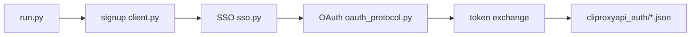

> [简体中文](README.md) | **English**

# grok-build-auth

A **protocol-research client** for publicly observable **x.ai / Grok web authentication** flows. It reimplements, over pure HTTP:

`signup → SSO → OAuth PKCE (Grok Build / CLI scopes) → local auth JSON export`

for protocol analysis, interoperability research, and **authorized** local integration testing.

Default path: signup/OAuth over pure HTTP (`curl_cffi`). **Turnstile only mints a token** via a local browser backend (`auto`→Drission+turnstilePatch; optional Camoufox / Playwright).

[](LICENSE)
[](https://www.python.org/)
[](#legal-boundary)

---

> [!CAUTION]
> **Using this project constitutes acceptance of all terms in [`NOTICE`](NOTICE).**  
> Provided **AS IS**, with **no warranties**. Maintainers accept **no liability**.  
> **Allowed only** on systems you own / legitimate CTF / authorized bug-bounty in-scope assets / security research & education.  
> **Prohibited:** fraud, bulk account farming for resale, unauthorized targets, intentional ToS abuse.  
> You bear all legal responsibility. If you do not accept the terms, **do not use, do not clone, delete every copy**.

---

## Legal boundary

| | |
|---|---|
| **Allowed** | Your own accounts and environments; clearly authorized security research; CTF / academic protocol study; offline source reading |
| **Prohibited** | Fraud, bulk signup for resale, unlicensed automation against unauthorized targets, intentional platform abuse |
| **Liability** | Account bans, quota loss, civil / criminal / administrative outcomes — **all on the user** |
| **Affiliation** | **Not** affiliated with, endorsed by, or sponsored by xAI, Grok, Cloudflare, CLIProxyAPI, or mailbox vendors |

Full terms: [`NOTICE`](NOTICE). License is [MIT](LICENSE), but **MIT is not the entire disclaimer**.

If you are unsure whether your use is lawful — **do not run**. Ask a lawyer first, or contact the target platform’s security team.

---

## What this is

A research-oriented protocol client, **not** an official SDK.

| Stage | Content |
|---|---|
| **Signup** | Email code (gRPC-web) + Turnstile + Next.js Server Action on `accounts.x.ai` |
| **SSO** | Session JWT extraction for OAuth session reuse |
| **OAuth** | `auth.x.ai` PKCE + cookie-setter + consent; CreateSession fallback |
| **Export** | Local `type=xai` auth files compatible with [CLIProxyAPI](https://github.com/router-for-me/CLIProxyAPI) (Grok Build channel) |

Highlights:

- **Protocol-first** pure HTTP (`curl_cffi`) for signup / OAuth  
- **Turnstile**: three local backends (see [Turnstile backends](#turnstile-backends)); default `auto`→Drission  
- **SSO reuse** can skip a second Turnstile on OAuth  
- **Lean outputs**: default writes only `sso_output/` + `cliproxyapi_auth/`  

SSO **alone cannot** become a CPA auth file; OAuth tokens are required.

---

## Architecture



---

## Requirements

- Python 3.9+
- Turnstile: local browser backend (default Drission + headed Chrome; optional Camoufox / Playwright)  
- Mailbox: Tempmail.lol **free tier (no API key)** by default; optional Plus/Ultra key or your Cloudflare D1 alias mailbox  
- Optional HTTP(S) proxy  
- Optional local CLIProxyAPI install to load exported auth files  

Platform terms, risk controls, and API changes may break the flow at any time. Maintainers have **no duty** to keep it working.

---

## Getting started

### Install

```bash
git clone https://github.com/<you>/grok-build-auth.git
cd grok-build-auth
python -m venv .venv
source .venv/bin/activate   # Windows: .venv\Scripts\activate
pip install -r requirements.txt
# optional Camoufox backend:
# pip install camoufox && camoufox fetch
cp .env.example .env
# put only your own secrets in .env — never commit it
```

### Configure

See [`.env.example`](.env.example). Never commit `.env` or runtime token directories. See [`SECURITY.md`](SECURITY.md).

| Variable | Required | Notes |
|---|---|---|
| `TURNSTILE_SOLVER` | no | `auto` (default) / `drission` / `camoufox` / `browser` — see [Turnstile backends](#turnstile-backends) |
| `TURNSTILE_HEADLESS` | no | drission/camoufox default `0` (headed); playwright default `1`; camoufox may use `virtual` |
| `TURNSTILE_TIMEOUT` | no | hard wall-clock seconds per mint (**drission default 30**; camoufox/browser default 60) |
| `TURNSTILE_PARALLEL` | no | concurrent Turnstile mint slots (default **2**; one thread-local Chrome per slot) |
| `TURNSTILE_MINIMIZED` | no | drission headed default `1`: minimize via Drission/CDP |
| `TURNSTILE_OFFSCREEN` | no | drission headed default `1`: off-screen `--window-position` backup |
| `TURNSTILE_BROWSER_CHANNEL` | no | playwright only; auto-selects system `chrome` when available |
| `TURNSTILE_INTERACTIVE` | no | playwright only: `1` = manual click (forces headed) |
| `TURNSTILE_BROWSER_REUSE` | no | `1` = warm browser reuse (default 1; drission is thread-local) |
| `TEMPMAIL_API_KEY` | no | Tempmail.lol Plus/Ultra (**free tier needs no key**) |
| `MAIL_CODE_TIMEOUT` | no | seconds to wait for code before rotating inbox (default 30) |
| `MAIL_MAX_ATTEMPTS` | no | max fresh inboxes when mail is silent (default 3) |
| `CLOUDFLARE_API_TOKEN` | for `-e cloudflare` | CF API token |
| `CLOUDFLARE_ACCOUNT_ID` | same | CF account |
| `CLOUDFLARE_D1_DB_ID` | same | D1 database ID |
| `ALIAS_MAIL_DOMAINS` | same | domains you control (comma-separated) |
| `CLIPROXYAPI_AUTH_DIR` | no | default `./cliproxyapi_auth` |
| `HTTPS_PROXY` / `HTTP_PROXY` | no | proxy |

### Run (research / accounts you own)

```bash
# Full pipeline: signup + SSO + Build OAuth → cliproxyapi_auth/
# Default Turnstile: auto → drission when DrissionPage is installed
python run.py -n 1

# Pick a Turnstile backend (see section below)
TURNSTILE_SOLVER=drission python run.py -n 1
TURNSTILE_SOLVER=camoufox python run.py -n 1
TURNSTILE_SOLVER=browser  python run.py -n 1

# Multi-account (signup + protocol OAuth concurrent; Turnstile default 2 parallel mints)
python run.py -n 5 -t 3
TURNSTILE_PARALLEL=2 TURNSTILE_SOLVER=drission python run.py -n 4 -t 4
python run.py -n 1 -e cloudflare
python run.py -n 1 --no-oauth
python run.py -n 1 --cliproxyapi-auth-dir /path/to/CLIProxyAPI/data/auth
python run.py -n 1 --accounts-output-dir ./accounts_output   # optional ledger
python run.py -n 1 --oauth-debug
# After OAuth, probe Build quota (off by default): keep only usable files
python run.py -n 1 --check-quota
python run.py -n 5 -t 4 --check-quota --failed-auth-dir ./cliproxyapi_auth_failed
```

### Runtime outputs

| Dir | Default | Purpose |
|---|---|---|
| `sso_output/` | **on** | per-account `sso_*.json` (email/password/SSO) + append-only `sso_tokens.txt` (one JWT per line) |
| `cliproxyapi_auth/` | **on** (unless `--no-oauth`) | CLIProxyAPI-ready auth JSON |
| `cliproxyapi_auth_failed/` | only with `--check-quota` | zero-quota auth (override with `--failed-auth-dir`) |
| `oauth_output/` | off | raw OAuth archive (standalone tools / explicit `output_dir`) |
| `accounts_output/` | off | pipeline ledger (`--accounts-output-dir`) |

Helpers:
- `check_accounts.py` — **only** auth usability / Build quota checker
- `xai_oauth_login.py`, `xai_oauth_export_cliproxyapi.py` — standalone OAuth helpers

---

## Turnstile backends

Signup is pure HTTP; **only the Cloudflare Turnstile token must be minted by a local browser**.  
Select a backend with `TURNSTILE_SOLVER` (or `resolve_turnstile_solver(backend=...)`).

### Which one?

| `TURNSTILE_SOLVER` | Stack | Headed by default? | When to use |
|---|---|---|---|
| **`auto` (default)** | DrissionPage installed → **drission**; else → **browser** | follows backend | daily default |
| **`drission`** | DrissionPage + system **Chrome** + `turnstilePatch/` | **yes** (`0`) | **recommended** for batch runs |
| **`camoufox`** | **Camoufox** anti-detect Firefox (launched via Playwright) | **yes** (`0`) | Firefox / anti-detect path; needs `camoufox fetch` |
| **`browser`** | Playwright Chromium/Chrome | **no** (`1`) | fallback when Drission is missing; often weaker on residential IPs |

Aliases:

- drission: `dp` / `clean` / `drissionpage`
- camoufox: `camou` / `camoufox-firefox`
- browser: `local` / `playwright` / `chromium` / `chrome` / `free`

Remote captcha APIs (YesCaptcha / CapSolver / 2Captcha, …) are **not** implemented.  
Legacy `obscura` backend is removed.

### Dependencies

```bash
pip install -r requirements.txt

# drission (default path): system Google Chrome required
# turnstilePatch/ ships in-repo

# camoufox extra:
pip install camoufox
camoufox fetch          # download Camoufox binary once
```

### Commands

```bash
# default = auto → drission
python run.py -n 1

# explicit Drission (recommended for batches)
TURNSTILE_SOLVER=drission TURNSTILE_HEADLESS=0 python run.py -n 10 -t 4

# Camoufox (headed is more reliable; try virtual without a display)
TURNSTILE_SOLVER=camoufox python run.py -n 1
TURNSTILE_SOLVER=camoufox TURNSTILE_HEADLESS=virtual python run.py -n 1

# Playwright fallback
TURNSTILE_SOLVER=browser python run.py -n 1
TURNSTILE_SOLVER=browser TURNSTILE_HEADLESS=0 python run.py -n 1
```

### Related env vars

| Variable | Default | Notes |
|---|---|---|
| `TURNSTILE_SOLVER` | `auto` | backend picker |
| `TURNSTILE_HEADLESS` | drission/camoufox=`0`; browser=`1` | `0` headed; `1` headless; camoufox also accepts `virtual` |
| `TURNSTILE_TIMEOUT` | drission=`30`; others=`60` | hard timeout per token mint (seconds); empty token fails ~12s |
| `TURNSTILE_PARALLEL` | `2` | concurrent mint slots (Semaphore); drission uses thread-local Chrome |
| `TURNSTILE_MINIMIZED` | `1` (headed) | minimize window via Drission/CDP |
| `TURNSTILE_OFFSCREEN` | `1` (headed) | off-screen `--window-position` backup |
| `TURNSTILE_BROWSER_REUSE` | `1` | warm browser reuse |
| `TURNSTILE_DEBUG` | off | `1` = verbose solver logs |
| `TURNSTILE_BROWSER_CHANNEL` | auto | browser only: prefer system Chrome |
| `TURNSTILE_INTERACTIVE` | off | browser only: manual click |
| `HTTPS_PROXY` / `HTTP_PROXY` | empty | proxy for browser + protocol HTTP |

Notes:

1. **Signup / mail code / SSO / OAuth stay pure HTTP**; the browser only mints `turnstileToken`.  
2. `run.py` bounds Turnstile with **`TURNSTILE_PARALLEL` (default 2)**; drission uses **thread-local Chrome** + empty-token fail-fast and `-t N` still speeds mail + protocol stages.  
3. With SSO, the OAuth fast path usually **skips** a second Turnstile.  
4. Headless is blocked more often; prefer **headed + minimized/off-screen + warm reuse** for batches.

### How to tell which backend ran

```text
[#1] Turnstile 730 chars via DrissionTurnstileSolver
# or CamoufoxTurnstileSolver / LocalBrowserTurnstileSolver
```

---

## Contributing

Contributions welcome **only** for lawful research and authorized use:

1. Protocol adaptations with repro steps / capture diffs  
2. Docs and translations  
3. Robustness (timeouts, retries, error taxonomy)  
4. Redacted research notes — **no** real tokens, emails, or cookies  

PRs/issues that request help with unauthorized abuse or bulk farming will be closed.

Security: private channel only — [`SECURITY.md`](SECURITY.md).

---

## Community

| Channel | Purpose |
|---|---|
| [**LINUX DO**](https://linux.do/) | Technical discussion, protocol research feedback, long-term notes |
| GitHub Issues | Bug reports and PRs (primary entry) |

---

## Disclaimer

> [!IMPORTANT]
> Using this project means you have read, understood, and accepted **all** of [`NOTICE`](NOTICE).  
> If you cannot accept — do not use; delete all copies.

**Summary (NOTICE controls):** AS IS; authorized scope only; user bears all liability; maintainers have no support or adaptation duty; no affiliation with xAI / Grok / Cloudflare / CLIProxyAPI or other named vendors.

License: [MIT](LICENSE) · Notice: [NOTICE](NOTICE) · Security: [SECURITY.md](SECURITY.md)
