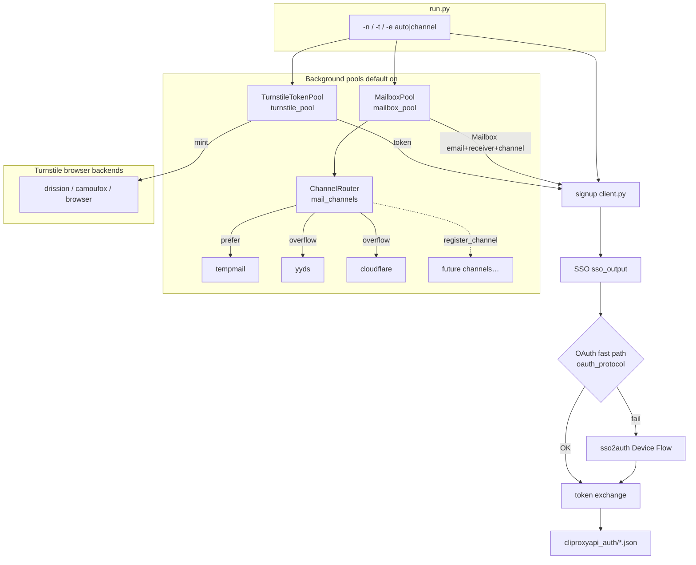

> [简体中文](README.md) | **English**

# grok-build-auth

A **protocol-research client** for publicly observable **x.ai / Grok web authentication** flows. It reimplements, over pure HTTP:

`signup → SSO → OAuth PKCE (Grok Build / CLI scopes) → local auth JSON export`

for protocol analysis, interoperability research, and **authorized** local integration testing.

Default path: signup/OAuth over pure HTTP (`curl_cffi`). Turnstile **token pool on by default**. Mailbox: **pluggable multi-channel registry + background mail pool on by default** (`-e auto` enables every configured channel — prefer high-RPM sources, overflow on rate limits; single channel → solo). OAuth: protocol session-reuse, Device Flow fallback.

[](LICENSE)
[](https://www.python.org/)
[](#legal-boundary)

---

> [!CAUTION]
> **Using this project constitutes acceptance of all terms in [`NOTICE`](NOTICE).**  
> Provided **AS IS**, with **no warranties**. Maintainers accept **no liability**.  
> **Allowed only** on systems you own / legitimate CTF / authorized bug-bounty in-scope assets / security research & education.  
> **Prohibited:** fraud, bulk account farming for resale, unauthorized targets, intentional ToS abuse.  
> You bear all legal responsibility. If you do not accept the terms, **do not use, do not clone, delete every copy**.

---

## Legal boundary

| | |
|---|---|
| **Allowed** | Your own accounts and environments; clearly authorized security research; CTF / academic protocol study; offline source reading |
| **Prohibited** | Fraud, bulk signup for resale, unlicensed automation against unauthorized targets, intentional platform abuse |
| **Liability** | Account bans, quota loss, civil / criminal / administrative outcomes — **all on the user** |
| **Affiliation** | **Not** affiliated with, endorsed by, or sponsored by xAI, Grok, Cloudflare, CLIProxyAPI, or mailbox vendors |

Full terms: [`NOTICE`](NOTICE). License is [MIT](LICENSE), but **MIT is not the entire disclaimer**.

If you are unsure whether your use is lawful — **do not run**. Ask a lawyer first, or contact the target platform’s security team.

---

## What this is

A research-oriented protocol client, **not** an official SDK.

| Stage | Content |
|---|---|
| **Signup** | Email code (gRPC-web) + Turnstile + Next.js Server Action on `accounts.x.ai` |
| **SSO** | Session JWT extraction for OAuth session reuse |
| **OAuth** | Fast path: `oauth_protocol` SSO session-reuse (PKCE + cookie-setter + consent); fallback: `sso2auth` Device Flow; pure HTTP end-to-end |
| **Export** | Local `type=xai` auth files compatible with [CLIProxyAPI](https://github.com/router-for-me/CLIProxyAPI) (Grok Build channel) |

Highlights:

- **Protocol-first** pure HTTP (`curl_cffi`) for signup / OAuth
- **Turnstile pool**: background mint, signup threads only consume; **on by default**; demand-driven (stop when stock covers demand)
- **Mail pool + multi-channel**: pluggable `mail_channels` registry; background inbox create; **prefer + overflow** (tempmail keeps its RPM; yyds/CF fill gaps — not a full switch on rate limit)
- **Auto-tune from `-t`**: token/mail pool size & minters scale with registration threads (env can pin values)
- **OAuth dual path**: SSO session-reuse (`oauth_protocol`); Device Flow fallback (`sso2auth`)
- **Lean outputs**: default writes `sso_output/` + `cliproxyapi_auth/`

CPA export needs OAuth `access_token` / `refresh_token` (protocol path or Device Flow).

---

## Architecture



---

## Requirements

This is **not** a zero-config product. At minimum you need:

- Python 3.9+
- Turnstile: local browser backend (default Drission + headed Chrome; optional Camoufox / Playwright)
- Mailbox: default `-e auto` — **all configured** channels (tempmail always; yyds/cloudflare when credentials exist); or force one with `-e tempmail|yyds|cloudflare`
- Optional HTTP(S) proxy
- Optional local CLIProxyAPI install to load exported auth files

Platform terms, risk controls, and API changes may break the flow at any time. Maintainers have **no duty** to keep it working.

---

## Getting started

### Install

```bash
git clone https://github.com/<you>/grok-build-auth.git
cd grok-build-auth
python -m venv .venv
source .venv/bin/activate   # Windows: .venv\Scripts\activate
pip install -r requirements.txt
# optional Camoufox backend:
# pip install camoufox && camoufox fetch
cp .env.example .env
# put only your own secrets in .env — never commit it
```

### Configure

See [`.env.example`](.env.example). Never commit `.env` or runtime token directories. See [`SECURITY.md`](SECURITY.md).

| Variable | Required | Notes |
|---|---|---|
| `TURNSTILE_SOLVER` | no | `auto` (default) / `drission` / `camoufox` / `browser` / `safari` — see [Turnstile backends](#turnstile-backends) |
| `TURNSTILE_HEADLESS` | no | drission/camoufox default `0` (headed); playwright default `1`; camoufox may use `virtual` |
| `TURNSTILE_TIMEOUT` | no | hard wall-clock seconds per mint (**drission default 30**; camoufox/browser default 60) |
| `TURNSTILE_POOL` | no | background token pool (**on by default**; `0` disables) |
| `TURNSTILE_POOL_SIZE` | no | hard max buffered tokens (**auto from `-t`**: `max(2, -t)`, cap 32) |
| `TURNSTILE_POOL_TARGET` | no | idle ready stock (default `min(2, size)`; stop minting when satisfied) |
| `TURNSTILE_POOL_MINTERS` | no | mint threads (**auto from `-t`**: `ceil(-t/4)` cap 4; Safari forced to 1) |
| `TURNSTILE_TOKEN_MAX_AGE` | no | max age of pooled tokens in seconds (default 200) |
| `TURNSTILE_PAUSE_FILE` | no | if present, pause mint/click (default `/tmp/grok-turnstile.pause`) |
| `TURNSTILE_PARALLEL` | no | mint slots **only when pool is off** (default follows `-t`, cap 8) |
| `TURNSTILE_MINIMIZED` | no | drission headed default `1`: minimize via Drission/CDP |
| `TURNSTILE_OFFSCREEN` | no | drission headed default `1`: off-screen window backup |
| `TURNSTILE_BROWSER_CHANNEL` | no | playwright only; auto-selects system `chrome` when available |
| `TURNSTILE_INTERACTIVE` | no | playwright only: `1` = manual click (forces headed) |
| `TURNSTILE_BROWSER_REUSE` | no | `1` = warm browser reuse (default 1; drission warm-page) |
| `TEMPMAIL_API_KEY` | no | Tempmail.lol Plus/Ultra (**free tier needs no key**) |
| `TEMPMAIL_FREE_CREATE_INTERVAL` | no | free-tier create min interval seconds (default **3 ≈ 20/min**) |
| `YYDS_API_KEY` / `YYDS_JWT` | no | YYDS mailbox (either; included by `-e auto` when set) |
| `YYDS_API_BASE` | no | default `https://maliapi.215.im/v1` |
| `YYDS_DOMAINS` | no | domain allow-list (empty = **all verified**, domain-level LB) |
| `MAIL_BACKENDS` | no | explicit channel list, overrides `-e auto` (e.g. `tempmail,yyds`) |
| `MAIL_CHANNEL_WEIGHTS` | no | preference, e.g. `tempmail:100,yyds:40,cloudflare:60` |
| `MAIL_CHANNEL_CAPACITY` | no | max concurrent creates per channel before overflow |
| `MAIL_POOL` | no | background inbox pool (**on by default**; `0` off) |
| `MAIL_POOL_SIZE` / `_TARGET` / `_MINTERS` | no | same semantics as turnstile pool (auto from `-t`) |
| `MAIL_POOL_MAX_AGE` | no | max age of pooled inboxes in seconds (default 600) |
| `MAIL_CODE_TIMEOUT` | no | seconds to wait for code before rotating inbox (default 30) |
| `MAIL_MAX_ATTEMPTS` | no | max fresh inboxes when mail is silent (default 3) |
| `CLOUDFLARE_API_TOKEN` | for `-e cloudflare` / auto-detect | CF API token |
| `CLOUDFLARE_ACCOUNT_ID` | same | CF account |
| `CLOUDFLARE_D1_DB_ID` | same | D1 database ID |
| `ALIAS_MAIL_DOMAINS` | same | domains you control (comma-separated) |
| `CLIPROXYAPI_AUTH_DIR` | no | default `./cliproxyapi_auth` |
| `HTTPS_PROXY` / `HTTP_PROXY` | no | single proxy (when no pool file) |
| `PROXY_POOL_FILE` | no | proxy list file, **one URL per line**; exit-IP geo probe on start |
| `PROXY_POOL` | no | small inline list; use FILE for large pools |
| `PROXY_REGION` | no | target country code (`us`/`jp`/`hk`…); rotate only matches |
| `PROXY_POOL_SCOPE` | no | `same_region` (**default**) / `all` |
| `PROXY_GEO_WORKERS` | no | concurrent probes (default 16) |
| `PROXY_GEO_CACHE` | no | probe cache (default `./.proxy_geo_cache.json`) |

### Run (research / accounts you own)

```bash
# Zero-config batch: -t 4 + token pool + mail pool + -e auto (prefer+overflow)
python run.py -n 20

# Single-account smoke
python run.py -n 1

# Concurrency (token/mail pools auto-retune; -t 8 → size=8 minters=2)
python run.py -n 20 -t 8

# Force a single channel (solo: may block on wait/retry)
python run.py -n 10 -e yyds
python run.py -n 10 -e tempmail
python run.py -n 1 -e cloudflare

# Explicit multi-channel list
MAIL_BACKENDS=tempmail,yyds python run.py -n 20 -t 8

# Weights / capacity (prefer tempmail; overflow when slots full)
MAIL_CHANNEL_WEIGHTS=tempmail:100,yyds:40 MAIL_CHANNEL_CAPACITY=tempmail:3,yyds:2 \
  python run.py -n 20 -t 8

# Disable mail pool (create at register time; router still works)
MAIL_POOL=0 python run.py -n 4 -t 2

# Pin token pool knobs
TURNSTILE_POOL_SIZE=6 TURNSTILE_POOL_MINTERS=2 python run.py -n 20 -t 4

# Disable token pool
TURNSTILE_POOL=0 python run.py -n 4 -t 2

# Turnstile backends
TURNSTILE_SOLVER=drission python run.py -n 10 -t 4
TURNSTILE_SOLVER=camoufox python run.py -n 1
TURNSTILE_SOLVER=browser  python run.py -n 1

# Proxy pool file
PROXY_POOL_FILE=./proxies.txt PROXY_REGION=us python run.py -n 10 -t 4

# Pause mint / HID clicks
touch /tmp/grok-turnstile.pause
rm    /tmp/grok-turnstile.pause

python run.py -n 1 --no-oauth
python run.py -n 1 --no-oauth-protocol
python run.py -n 1 --cliproxyapi-auth-dir /path/to/CLIProxyAPI/data/auth
python run.py -n 1 --accounts-output-dir ./accounts_output
python run.py -n 1 --oauth-debug
python run.py -n 1 --check-quota
python run.py -n 5 -t 4 --check-quota --failed-auth-dir ./cliproxyapi_auth_failed
```

### Runtime outputs

| Dir | Default | Purpose |
|---|---|---|
| `sso_output/` | **on** | per-account `sso_*.json` (email/password/SSO) + append-only `sso_tokens.txt` (one JWT per line) |
| `cliproxyapi_auth/` | **on** (unless `--no-oauth`) | CLIProxyAPI-ready auth JSON |
| `cliproxyapi_auth_failed/` | only with `--check-quota` | zero-quota auth (override with `--failed-auth-dir`) |
| `oauth_output/` | off | raw OAuth archive (standalone tools / explicit `output_dir`) |
| `accounts_output/` | off | pipeline ledger (`--accounts-output-dir`) |

Helpers:
- `check_accounts.py` — auth usability / Build quota
- `retry_oauth_from_sso.py` — SSO → CPA Device Flow
- `xai_oauth_login.py` — interactive browser OAuth
- `xai_oauth_export_cliproxyapi.py` — export oauth_output → CPA auth

---

## Token pool (default)

Signup threads **only consume** tokens; background minters mint via a local browser. On by default to avoid cold-starting a browser per account and over-minting while idle.

### Why a pool

| Mode | Behavior | Use when |
|---|---|---|
| **Pool on (default)** | Background keeps a small stock; signup HTTP path acquires tokens | Batches / run while working |
| **Pool off** | Each signup thread calls `solve_turnstile` under `TURNSTILE_PARALLEL` | Debugging a single mint |

### Demand-driven minting

- **Idle**: keep only `target` ready tokens (default 2); log `pool mint pause (satisfied …)`
- **Waiters present**: desire expands to `min(size, waiting + target)`
- **Slow mint finishes after demand is covered**: drop the surplus instead of filling the hard cap

### Auto-tune from `-t`

When the matching env vars are unset, `suggest_pool_params(-t)` applies:

| Param | Auto rule | Examples |
|---|---|---|
| `size` | `clamp(-t, 2..32)` | `-t4→4`, `-t8→8` |
| `target` | `min(2, size)` | idle stock of 2 |
| `minters` | `ceil(-t/4)` cap 4; **Safari forced to 1** | `-t4→1`, `-t8→2`, `-t16→4` |
| `PARALLEL` (pool off) | `min(8, -t)` | matches registration concurrency |

Explicit `TURNSTILE_POOL_SIZE` / `_TARGET` / `_MINTERS` / `TURNSTILE_PARALLEL` win over auto.

### Drission warm-page mint (recommended)

- Each worker **navigates signup once**
- Later mints reuse the page (`force-render` + CDP click) ≈ **2.3–2.5s/token** (first cold mint ≈ 10–16s)
- Headed defaults: **minimized + off-screen** to avoid stealing OS focus

### Tempmail free alignment

- CLI default **`-t 4`** targets free-tier steady throughput
- Without `TEMPMAIL_API_KEY`, inbox `create` is paced at **3s** (≈20/min) process-wide
- Plus/Ultra key skips free create pacing; raise `-t` if needed
- **Multi-channel**: free pacing / 429 only blocks tempmail *for that slot*; yyds/etc. overflow immediately; tempmail is preferred again when ready (not a full switch)

### How to read startup logs

```text
grok-build-auth: 20 accounts, 4 threads, email=auto, ... pool=on, mail-pool=on
  mail-channels:        tempmail,yyds (prefer+overflow; weights via MAIL_CHANNEL_WEIGHTS)
  turnstile-pool:       size=4 target=2 minters=1 max_age=200s (auto from -t=4)
  mail-pool:            size=4 target=2 minters=1 max_age=600s (auto from -t=4)
  [ts-pool] pool +1 len=837 q=1/4 want=2 wait=0
  [mail-pool] mail pool +1 [tempmail] xai…@… q=2/4
  [mail] mail channel tempmail rate: … (next_slot≈3.0s; overflow/retry)
  [mail] mail create via yyds: xai…@…
  [3/20] [#2] email [yyds]: xai…@…
  [3/20] [#2] Turnstile 837 chars from pool (age=6s q=1)
```

---

## Mail pool & multi-channel (default)

Signup threads **only consume** ready `Mailbox(email, receiver, channel)` objects; background minters create via the channel router. On by default, warming in parallel with the Turnstile pool.

### Channel registry (extensible)

| Channel | Default weight | Available when | Notes |
|---|---|---|---|
| **tempmail** | 100 | always (free or `TEMPMAIL_API_KEY`) | usually highest create RPM; preferred |
| **yyds** | 40 | `YYDS_API_KEY` or `YYDS_JWT` | overflow / top-up; domain-level LB |
| **cloudflare** | 60 | `CLOUDFLARE_*` + `ALIAS_MAIL_DOMAINS` | self-hosted D1 alias mail |
| **custom** | yours | `configured()` | `register_channel(ChannelSpec(...))` — auto picks up in CLI/`auto` |

```python
from xconsole_client.mail_channels import ChannelSpec, register_channel

register_channel(ChannelSpec(
    name="mymail",
    weight=55,
    capacity=2,
    configured=lambda: bool(os.environ.get("MYMAIL_KEY")),
    create=lambda: (email, receiver),  # receiver.wait_for_code(timeout=…)
))
```

### Solo vs multi

| Mode | When | Behavior |
|---|---|---|
| **Solo** | exactly one resolved channel (`-e yyds`, single backend, or `MAIL_BACKENDS=yyds`) | may block on wait/retry (legacy single-backend path) |
| **Multi** | `-e auto` with ≥2 available | **prefer + overflow**: use high-weight when a slot is free; rate limits only delay *that* slot, other ready channels fill immediately |

### Pool knobs (from `-t`)

| Param | Auto rule | Env |
|---|---|---|
| size | `clamp(-t, 2..32)` | `MAIL_POOL_SIZE` |
| target | `min(2, size)` | `MAIL_POOL_TARGET` |
| minters | `ceil(-t/4)` cap 4 | `MAIL_POOL_MINTERS` |
| max_age | 600s | `MAIL_POOL_MAX_AGE` |
| enable | on by default | `MAIL_POOL=0` to disable |

---

## Turnstile backends

Signup is pure HTTP; **only the Cloudflare Turnstile token must be minted by a local browser**.  
Select a backend with `TURNSTILE_SOLVER` (or `resolve_turnstile_solver(backend=...)`).

### Which one?

| `TURNSTILE_SOLVER` | Stack | Headed by default? | When to use |
|---|---|---|---|
| **`auto` (default)** | DrissionPage installed → **drission**; else → **browser** | follows backend | daily default |
| **`drission`** | DrissionPage + system **Chrome** + `turnstilePatch/` | **yes** (`0`) | **recommended** for warm-page pool batches |
| **`camoufox`** | **Camoufox** anti-detect Firefox (via Playwright) | **yes** (`0`) | Firefox / anti-detect; needs `camoufox fetch` |
| **`browser`** | Playwright Chromium/Chrome | **no** (`1`) | fallback without Drission |
| **`safari`** | system Safari (macOS) | steals focus | manual/single path; pool minters fixed at 1 |

Aliases:

- drission: `dp` / `clean` / `drissionpage`
- camoufox: `camou` / `camoufox-firefox`
- browser: `local` / `playwright` / `chromium` / `chrome` / `free`
- safari: `webkit-system` / `system-safari`

### Dependencies

```bash
pip install -r requirements.txt

# drission (default path): system Google Chrome required
# turnstilePatch/ ships in-repo

# camoufox extra:
pip install camoufox
camoufox fetch
```

### Commands

```bash
# default = auto → drission + pool on + -t 4
python run.py -n 20

TURNSTILE_SOLVER=drission python run.py -n 10 -t 4
TURNSTILE_SOLVER=camoufox python run.py -n 1
TURNSTILE_SOLVER=camoufox TURNSTILE_HEADLESS=virtual python run.py -n 1
TURNSTILE_SOLVER=browser python run.py -n 1
TURNSTILE_SOLVER=browser TURNSTILE_HEADLESS=0 python run.py -n 1
```

### Related env vars

| Variable | Default | Notes |
|---|---|---|
| `TURNSTILE_SOLVER` | `auto` | backend picker |
| `TURNSTILE_HEADLESS` | drission/camoufox=`0`; browser=`1` | `0` headed; `1` headless; camoufox also `virtual` |
| `TURNSTILE_TIMEOUT` | drission=`30`; others=`60` | hard timeout per mint |
| `TURNSTILE_POOL` | **on** | `0` disables pool |
| `TURNSTILE_POOL_SIZE` | from `-t` | hard buffer cap |
| `TURNSTILE_POOL_TARGET` | `min(2,size)` | idle stock; pause when satisfied |
| `TURNSTILE_POOL_MINTERS` | from `-t` | background mint threads; Safari=1 |
| `TURNSTILE_PARALLEL` | from `-t` (pool off only) | live mint concurrency, cap 8 |
| `TURNSTILE_MINIMIZED` | `1` (headed) | minimize window |
| `TURNSTILE_OFFSCREEN` | `1` (headed) | off-screen backup |
| `TURNSTILE_BROWSER_REUSE` | `1` | warm reuse / warm page |
| `TURNSTILE_DEBUG` | off | `1` = verbose solver logs |
| `TURNSTILE_BROWSER_CHANNEL` | auto | browser only: prefer system Chrome |
| `TURNSTILE_INTERACTIVE` | off | browser only: manual click |
| `HTTPS_PROXY` / `HTTP_PROXY` | empty | single proxy |
| `PROXY_POOL_FILE` | empty | one proxy URL per line; geo-probe on start |
| `PROXY_REGION` | auto/set | if set, rotate only that country after probe |
| `PROXY_POOL_SCOPE` | `same_region` | `same_region` or `all` |
| `PROXY_GEO_WORKERS` | `16` | concurrent geo probes |
| `PROXY_GEO_CACHE` | `./.proxy_geo_cache.json` | region cache |

Notes:

1. Signup / mail / SSO / OAuth use protocol HTTP; Turnstile mint is only needed before create-account.  
2. **Token pool is default**: background mint; signup threads take `from pool`. `TURNSTILE_PARALLEL` applies only when pool is off.  
3. Drission warm-page ≈ 2.4s/token; first cold mint is slower.  
4. OAuth: SSO session-reuse first, Device Flow on failure.  
5. Prefer **headed + minimized/off-screen + warm reuse + pool** for batches.

### How to tell which path ran

```text
# pool mode (default)
[ts-pool] pool +1 len=837 q=2/4 want=2 wait=0
[#3] Turnstile 837 chars from pool (age=4s q=1)

# pool off
[#1] Turnstile 730 chars via DrissionTurnstileSolver
```

---

## Contributing

Contributions welcome **only** for lawful research and authorized use:

1. Protocol adaptations with repro steps / capture diffs  
2. Docs and translations  
3. Robustness (timeouts, retries, error taxonomy)  
4. Redacted research notes — **no** real tokens, emails, or cookies  

PRs/issues that request help with unauthorized abuse or bulk farming will be closed.

Security: private channel only — [`SECURITY.md`](SECURITY.md).

---

## Community

| Channel | Purpose |
|---|---|
| GitHub Issues | Bug reports and PRs (primary entry) |

---

## Disclaimer

> [!IMPORTANT]
> Using this project means you have read, understood, and accepted **all** of [`NOTICE`](NOTICE).  
> If you cannot accept — do not use; delete all copies.

**Summary (NOTICE controls):** AS IS; authorized scope only; user bears all liability; maintainers have no support or adaptation duty; no affiliation with xAI / Grok / Cloudflare / CLIProxyAPI or other named vendors.

License: [MIT](LICENSE) · Notice: [NOTICE](NOTICE) · Security: [SECURITY.md](SECURITY.md)
