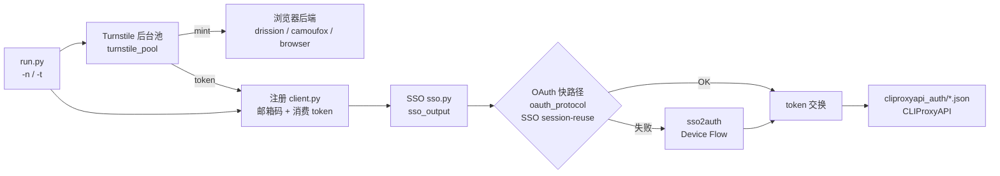

> **简体中文** | [English](README.en.md)

# grok-build-auth

面向 **x.ai / Grok 公开 Web 认证链路** 的协议研究客户端：用纯 HTTP 复现  
`注册 → SSO → OAuth PKCE（Grok Build / CLI scope）→ 导出本地 auth JSON`  
整条链路，便于协议分析、互操作性研究与本地集成测试。

默认：注册/OAuth 走纯 HTTP（`curl_cffi`）；注册阶段 Turnstile 用本机浏览器后端（默认 `auto`→Drission+turnstilePatch；可选 Camoufox / Playwright），**后台 token 池默认开启**，深度/mint 并发随 `-t` 自动；邮箱默认 Tempmail free（约 `-t 4` 稳态）。OAuth：协议 session-reuse，失败回退 Device Flow。

[](LICENSE)
[](https://www.python.org/)
[](#法律边界)

---

> [!CAUTION]
> **使用本项目即视为同意 [`NOTICE`](NOTICE) 的全部条款。**  
> 项目按 **AS IS** 提供、无任何担保、维护者不负任何责任。  
> **仅限**：你拥有的系统 / 合法 CTF / 授权 bug bounty in-scope 资产 / 安全研究与教学。  
> **严禁**：欺诈、批量造号转售、黑产代注册、未授权目标、故意违反第三方 ToS。  
> 一切法律责任由使用者自负。不接受条款就**不要使用、不要 clone、删除全部副本**。

---

## 法律边界

| | 说明 |
|---|---|
| **允许** | 自有账号与本地环境；明确授权范围内的安全研究；CTF / 课堂 / 学术协议研究；离线阅读源码 |
| **禁止** | 欺诈滥用、批量造号转售、代注册牟利、未授权自动化攻击、规避平台安全机制用于非法目的 |
| **责任** | 账号封禁、额度损失、民事 / 刑事 / 行政责任等全部由**使用者**承担 |
| **关系** | 与 xAI、Grok、Cloudflare、CLIProxyAPI、临时邮箱等服务商**无隶属、无授权、无赞助** |

完整条款见 [`NOTICE`](NOTICE)。License 是 [MIT](LICENSE)，但 **MIT 不是免责的全部**。

不确定是否合法 —— **不要运行**。先问律师，或先联系目标平台安全团队。

---

## 这是什么

研究型协议客户端，不是官方 SDK。主要能力：

| 阶段 | 内容 |
|---|---|
| **注册** | `accounts.x.ai` 邮箱验证码（gRPC-web）+ Turnstile + Next.js Server Action 建号 |
| **SSO** | 从建号响应 / set-cookie 链提取 session JWT，供 OAuth 复用 |
| **OAuth** | 快路径：`oauth_protocol` SSO session-reuse（PKCE + CookieSetter + consent）；失败回退 `sso2auth` Device Flow；全程纯 HTTP |
| **导出** | 写出与 [CLIProxyAPI](https://github.com/router-for-me/CLIProxyAPI) 兼容的本地 `type=xai` auth 文件（Grok Build 通道） |

值得看的点：

- **协议优先**：注册 / OAuth 默认纯 HTTP（`curl_cffi` 指纹会话）
- **Turnstile 池**：后台 mint、注册线程只消费；**默认开启**；按需产 token（够用即停）
- **随 `-t` 自动调参**：池深度 / mint 并发随注册并发缩放（也可 env 固定）
- **OAuth 双路径**：快路径 SSO session-reuse（`oauth_protocol`）；回退 Device Flow（`sso2auth`）
- **精简落盘**：默认写 `sso_output/` + `cliproxyapi_auth/`（CPA 可加载）

---

## 架构



导出 CPA auth 需要 OAuth 拿到的 `access_token` / `refresh_token`（协议路径或 Device Flow）。

---

## 现状与门槛

这不是「零配置即用」的产品。至少需要：

- Python 3.9+
- Turnstile：本机浏览器后端（默认 Drission + Chrome 有头；可选 Camoufox / Playwright）
- 临时邮箱：默认 Tempmail.lol **免费层（无需 API key）**；可选 Plus/Ultra key 或自建 Cloudflare D1 别名邮箱
- （可选）HTTP(S) 代理
- （可选）本地已安装的 CLIProxyAPI，用于加载导出的 auth 目录

平台条款、风控、接口变更会导致链路随时失效；维护者**无义务**持续适配。

---

## 上手

### 安装

```bash
git clone https://github.com/<you>/grok-build-auth.git
cd grok-build-auth
python -m venv .venv

# Windows
.venv\Scripts\activate
# macOS / Linux
# source .venv/bin/activate

pip install -r requirements.txt
# 可选：Camoufox 后端还要拉浏览器二进制
# pip install camoufox && camoufox fetch
cp .env.example .env
# 可选编辑 .env；通常只需代理，无需 TEMPMAIL key
```

### 配置

| 变量 | 必须 | 说明 |
|---|---|---|
| `TURNSTILE_SOLVER` | 否 | `auto`（默认）/ `drission` / `camoufox` / `browser` / `safari` — 见 [Turnstile 后端](#turnstile-后端) |
| `TURNSTILE_HEADLESS` | 否 | drission/camoufox 默认 `0`（有头）；playwright 默认 `1`；camoufox 可 `virtual` |
| `TURNSTILE_TIMEOUT` | 否 | 单次 mint 硬超时秒数（**drission 默认 30**；camoufox/browser 默认 60） |
| `TURNSTILE_POOL` | 否 | 后台 token 池（**默认开**；`0` 关闭） |
| `TURNSTILE_POOL_SIZE` | 否 | 池硬上限（**默认随 `-t`**：`= max(2, -t)`，上限 32） |
| `TURNSTILE_POOL_TARGET` | 否 | 空闲预存（默认 `min(2, size)`；够用即停产） |
| `TURNSTILE_POOL_MINTERS` | 否 | mint 线程数（**默认随 `-t`**：`ceil(-t/4)` 上限 4；Safari 固定 1） |
| `TURNSTILE_TOKEN_MAX_AGE` | 否 | 池内 token 最大年龄秒（默认 200） |
| `TURNSTILE_PAUSE_FILE` | 否 | 存在则暂停 mint/点击（默认 `/tmp/grok-turnstile.pause`） |
| `TURNSTILE_PARALLEL` | 否 | **仅池关闭时** mint 并发（默认随 `-t`，上限 8） |
| `TURNSTILE_MINIMIZED` | 否 | drission 有头时默认 `1`：最小化窗口 |
| `TURNSTILE_OFFSCREEN` | 否 | drission 有头时默认 `1`：离屏窗口备份 |
| `TURNSTILE_BROWSER_CHANNEL` | 否 | 仅 playwright；有系统 Chrome 时自动选 `chrome` |
| `TURNSTILE_INTERACTIVE` | 否 | 仅 playwright：`1` = 手动点选（强制有头） |
| `TURNSTILE_BROWSER_REUSE` | 否 | `1` = 热复用浏览器（默认 1；drission 暖页复用） |
| `TEMPMAIL_API_KEY` | 否 | Tempmail.lol Plus/Ultra（**免费层无需 key**） |
| `TEMPMAIL_FREE_CREATE_INTERVAL` | 否 | 无 key 时 create 最小间隔秒（默认 **3 ≈ 20/min**，贴 free 上限） |
| `MAIL_CODE_TIMEOUT` | 否 | 等验证码秒数，超时换箱（默认 30） |
| `MAIL_MAX_ATTEMPTS` | 否 | 静默邮箱最多换几次（默认 3） |
| `CLOUDFLARE_API_TOKEN` | `-e cloudflare` 时 | CF API token |
| `CLOUDFLARE_ACCOUNT_ID` | 同上 | CF 账户 |
| `CLOUDFLARE_D1_DB_ID` | 同上 | D1 库 ID |
| `ALIAS_MAIL_DOMAINS` | 同上 | 你控制的邮箱域名（逗号分隔） |
| `CLIPROXYAPI_AUTH_DIR` | 否 | 默认 `./cliproxyapi_auth` |
| `HTTPS_PROXY` / `HTTP_PROXY` | 否 | 代理 |

**永远不要**把 `.env`、token 目录提交进 Git。详见 [`SECURITY.md`](SECURITY.md)。

### 运行（研究 / 自有账号场景）

```bash
# 零配置批量：默认 -t 4 + token 池 on + Tempmail free 节流
# 池 size/minters 自动跟 -t；够用即停产
python run.py -n 20

# 单号冒烟
python run.py -n 1

# 改并发（池参数自动跟着变；-t 8 → size=8 minters=2）
python run.py -n 20 -t 8

# 固定池参数（覆盖自动）
TURNSTILE_POOL_SIZE=6 TURNSTILE_POOL_MINTERS=2 python run.py -n 20 -t 4

# 关池（退回每线程现场 mint；PARALLEL 默认= -t）
TURNSTILE_POOL=0 python run.py -n 4 -t 2

# 指定 Turnstile 后端
TURNSTILE_SOLVER=drission python run.py -n 10 -t 4
TURNSTILE_SOLVER=camoufox python run.py -n 1
TURNSTILE_SOLVER=browser  python run.py -n 1

# 临时暂停 mint / HID 点击（边干活边跑）
touch /tmp/grok-turnstile.pause   # 暂停
rm    /tmp/grok-turnstile.pause   # 恢复

# 自建 Cloudflare 邮箱 / 仅 SSO / Device Flow
python run.py -n 1 -e cloudflare
python run.py -n 1 --no-oauth
python run.py -n 1 --no-oauth-protocol

# 指定 CLIProxyAPI auth 目录 / 台账 / 调试
python run.py -n 1 --cliproxyapi-auth-dir /path/to/CLIProxyAPI/data/auth
python run.py -n 1 --accounts-output-dir ./accounts_output
python run.py -n 1 --oauth-debug

# OAuth 后探测额度（默认关）
python run.py -n 1 --check-quota
python run.py -n 5 -t 4 --check-quota --failed-auth-dir ./cliproxyapi_auth_failed
```

### 运行产物

| 目录 | 默认 | 内容 |
|---|---|---|
| `sso_output/` | **写** | 每号 `sso_*.json`（邮箱/密码/SSO）；另追加纯 SSO 列表 `sso_tokens.txt`（每行一个 JWT） |
| `cliproxyapi_auth/` | **写**（未 `--no-oauth`） | CLIProxyAPI `type=xai` auth |
| `cliproxyapi_auth_failed/` | 仅 `--check-quota` | 探测无额度的 auth（可用 `--failed-auth-dir` 改路径） |
| `oauth_output/` | 可选 | 原始 OAuth 归档（`xai_oauth_login` 或显式 `output_dir`） |
| `accounts_output/` | 可选 | 流水线台账（`--accounts-output-dir`） |

### 辅助脚本

```bash
# 检查 cliproxyapi_auth 可用性 / Build 额度
python check_accounts.py cliproxyapi_auth/

# SSO → CPA（Device Flow）
python retry_oauth_from_sso.py
# SSO2AUTH_WORKERS=4 python retry_oauth_from_sso.py

# 交互式浏览器 OAuth
python xai_oauth_login.py

# oauth_output → CPA auth
python xai_oauth_export_cliproxyapi.py --cliproxyapi-auth-dir ./cliproxyapi_auth
```

### 导出文件形态（本地文件，非官方密钥）

```json
{
  "type": "xai",
  "auth_kind": "oauth",
  "access_token": "...",
  "refresh_token": "...",
  "base_url": "https://cli-chat-proxy.grok.com/v1",
  "headers": {
    "X-XAI-Token-Auth": "xai-grok-cli",
    "x-grok-client-version": "0.2.93",
    "x-grok-client-identifier": "grok-shell"
  }
}
```

将 CLIProxyAPI 的 `auth-dir` 指向该目录后按 CPA 文档热加载即可（仅限合法自用场景）。

---

## Token 池（默认）

注册线程**只消费** token；后台 minter 用浏览器 mint。默认开启，降低「每号冷启动浏览器」和空闲超产风险。

### 为什么要池

| 模式 | 行为 | 适用 |
|---|---|---|
| **池 on（默认）** | 后台预产少量 token；注册 HTTP 路径直接取用 | 批量、边干活边跑 |
| **池 off** | 每个注册线程现场 `solve_turnstile`（`TURNSTILE_PARALLEL` 限流） | 调试单次 mint |

### 按需生产（够用即停）

- **空闲**：只保持 `target` 枚预存（默认 2），到量后日志 `pool mint pause (satisfied …)`
- **有人在等**：库存目标扩到 `min(size, waiting + target)`，盖住当前注册压力
- **慢 mint 完成后若已够用**：丢弃多余枚，避免灌满硬上限

### 随 `-t` 自动调参

未设置对应 env 时，由 `suggest_pool_params(-t)` 推算：

| 参数 | 自动规则 | 例 |
|---|---|---|
| `size` | `clamp(-t, 2..32)` | `-t4→4`，`-t8→8` |
| `target` | `min(2, size)` | 空闲只囤 2 |
| `minters` | `ceil(-t/4)` 上限 4；**Safari 固定 1** | `-t4→1`，`-t8→2`，`-t16→4` |
| 池关闭时 `PARALLEL` | `min(8, -t)` | 跟注册并发对齐 |

显式 `TURNSTILE_POOL_SIZE` / `_TARGET` / `_MINTERS` / `TURNSTILE_PARALLEL` 优先于自动。

### Drission 暖页 mint（推荐）

- 每 worker **只 navigate 一次** signup 页
- 之后同页 `force-render` + CDP 点击，暖 mint 约 **2.3–2.5s/枚**（冷启动首枚约 10–16s）
- 有头默认 **最小化 + 离屏**，尽量不抢系统焦点

### 与 Tempmail free 对齐

- CLI 默认 **`-t 4`**：贴近 free 层稳态吞吐
- 无 `TEMPMAIL_API_KEY` 时，`create` 进程级节流默认 **3s/次（≈20/min）**，减轻 429
- 有 Plus/Ultra key 时跳过 free create 节流；可自行提高 `-t`

### 启动日志怎么读

```text
grok-build-auth: 20 accounts, 4 threads, ... turnstile=auto, pool=on
  turnstile-pool: size=4 target=2 minters=1 max_age=200s (auto from -t=4)
  [ts-pool] token pool start size=4 target=2 ...
  [ts-pool] pool +1 len=837 q=1/4 want=2 wait=0
  [ts-pool] pool mint pause (satisfied q=2/4 want=2 waiting=0)
  [3/20] [#2] Turnstile 837 chars from pool (age=6s q=1)
```

---

## Turnstile 后端

注册主链路是纯 HTTP；**只有 Cloudflare Turnstile token 必须靠本机浏览器 mint**。  
用环境变量 `TURNSTILE_SOLVER` 选后端（也可用 `resolve_turnstile_solver(backend=...)`）。

### 怎么选

| `TURNSTILE_SOLVER` | 栈 | 默认有头？ | 何时用 |
|---|---|---|---|
| **`auto`（默认）** | 有 DrissionPage → **drission**；否则 → **browser** | 随所选后端 | 日常默认，不用改 |
| **`drission`** | DrissionPage + 本机 **Chrome** + `turnstilePatch/` | **是**（`0`） | **推荐主力**；暖页池 + 终端批量 |
| **`camoufox`** | **Camoufox** 反检测 Firefox（经 Playwright 启动） | **是**（`0`） | 想换 Firefox / 反检测；需额外 `camoufox fetch` |
| **`browser`** | Playwright Chromium/Chrome | **否**（`1`） | 没装 Drission 时的回退；本机 IP 上往往不如前两者稳 |
| **`safari`** | 系统 Safari（macOS） | 会抢焦点 | 手动/单路；池 minters 固定 1 |

别名：

- drission：`dp` / `clean` / `drissionpage`
- camoufox：`camou` / `camoufox-firefox`
- browser：`local` / `playwright` / `chromium` / `chrome` / `free`
- safari：`webkit-system` / `system-safari`

### 依赖

```bash
# 三种后端共用
pip install -r requirements.txt

# drission（默认路径）额外需要：本机已装 Google Chrome
# turnstilePatch/ 扩展已随仓库提供，无需手装

# camoufox 额外：
pip install camoufox
camoufox fetch          # 下载 Camoufox 浏览器二进制（约数百 MB，一次即可）
```

### 常用命令

```bash
# 默认 = auto → drission + 池 on + -t 4
python run.py -n 20

# 显式 Drission 批量
TURNSTILE_SOLVER=drission python run.py -n 10 -t 4

# Camoufox（有头更稳；无显示器可试 virtual）
TURNSTILE_SOLVER=camoufox python run.py -n 1
TURNSTILE_SOLVER=camoufox TURNSTILE_HEADLESS=virtual python run.py -n 1

# Playwright 回退（默认 headless）
TURNSTILE_SOLVER=browser python run.py -n 1
TURNSTILE_SOLVER=browser TURNSTILE_HEADLESS=0 python run.py -n 1
```

### 相关环境变量

| 变量 | 默认 | 说明 |
|---|---|---|
| `TURNSTILE_SOLVER` | `auto` | 后端选择，见上表 |
| `TURNSTILE_HEADLESS` | drission/camoufox=`0`；browser=`1` | `0` 有头；`1` headless；camoufox 还可 `virtual` |
| `TURNSTILE_TIMEOUT` | drission=`30`；其它=`60` | 单次 mint 硬超时（秒） |
| `TURNSTILE_POOL` | **开** | `0` 关池 |
| `TURNSTILE_POOL_SIZE` | 随 `-t` | 池硬上限 |
| `TURNSTILE_POOL_TARGET` | `min(2,size)` | 空闲预存；够用停产 |
| `TURNSTILE_POOL_MINTERS` | 随 `-t` | 后台 mint 线程；Safari=1 |
| `TURNSTILE_PARALLEL` | 随 `-t`（仅池关） | 现场 mint 并发上限 8 |
| `TURNSTILE_MINIMIZED` | `1`（有头） | 最小化窗口 |
| `TURNSTILE_OFFSCREEN` | `1`（有头） | 离屏备份 |
| `TURNSTILE_BROWSER_REUSE` | `1` | 热复用 / 暖页 |
| `TURNSTILE_DEBUG` | 关 | `1` 打印 solver 详细日志 |
| `TURNSTILE_BROWSER_CHANNEL` | 自动 | 仅 browser：优先系统 Chrome |
| `TURNSTILE_INTERACTIVE` | 关 | 仅 browser：手动点选 |
| `HTTPS_PROXY` / `HTTP_PROXY` | 空 | 浏览器与协议请求代理 |

说明：

1. 注册 / 验码 / SSO / OAuth 走协议 HTTP；Turnstile 只在注册建号前 mint。  
2. **默认 token 池**：后台 mint、注册线程 `from pool` 取用；池关才走 `TURNSTILE_PARALLEL`。  
3. drission 暖页约 2.4s/枚；冷启动首枚更慢。  
4. OAuth：优先 SSO session-reuse，失败 Device Flow。  
5. headless 更容易被 CF 拦；批量优先 **有头 + 最小化/离屏 + 暖复用 + 池**。

### 日志里怎么认后端 / 池

```text
# 池模式（默认）
[ts-pool] pool +1 len=837 q=2/4 want=2 wait=0
[#3] Turnstile 837 chars from pool (age=4s q=1)

# 池关闭时的 solver 名
[#1] Turnstile 730 chars via DrissionTurnstileSolver
[#1] Turnstile 730 chars via CamoufoxTurnstileSolver
[#1] Turnstile … via LocalBrowserTurnstileSolver
```

---

## 协议概要

**注册**

1. Warm-up + 动态抓取 Next.js action  
2. 临时邮箱创建 + 验证码（gRPC-web）  
3. Turnstile（本机浏览器后端 mint token，见 [Turnstile 后端](#turnstile-后端)）  
4. `create_account` + 提取 SSO → `sso_output/sso_*.json` + 追加 `sso_tokens.txt`  

**Build OAuth**（`run.py` 注册后）

1. **快路径** `oauth_protocol`：注册 SSO → CookieSetter + consent → code → token  
2. **回退** `sso2auth`：SSO cookie → Device Flow（device/code → verify/approve → poll token）→ 写 CPA JSON  
3. 默认写出 `cliproxyapi_auth/`  
4. `--no-oauth-protocol`：只走 Device Flow  

接口与额度策略以平台实时行为为准，文档数值仅供研究参考。

---

## 目录结构

```text
.
├── NOTICE                         # 具有约束力的使用须知（必读）
├── LICENSE                        # MIT
├── README.md / README.en.md
├── SECURITY.md
├── run.py                         # 主入口
├── check_accounts.py              # auth 可用性 / Build 额度
├── retry_oauth_from_sso.py        # SSO → CPA Device Flow
├── xai_oauth_login.py             # 交互式浏览器 OAuth
├── xai_oauth_export_cliproxyapi.py
├── requirements.txt
├── .env.example
├── xconsole_client/               # 协议库（Python 包名，历史命名）
│   ├── client.py                  # 注册
│   ├── oauth_protocol.py          # 协议 OAuth（SSO session-reuse）
│   ├── sso2auth.py                # SSO Device Flow → CPA
│   ├── xai_oauth.py               # PKCE / 导出 / 浏览器登录
│   ├── tempmail_transport.py      # Tempmail.lol（free create 节流）
│   ├── turnstile_pool.py          # 后台 token 池（默认 on，随 -t 自动）
│   ├── solver.py                  # Turnstile 工厂
│   ├── drission_solver.py         # Drission + turnstilePatch（暖页复用）
│   ├── camoufox_solver.py         # Camoufox
│   └── sso.py / ...
├── turnstilePatch/                # Chrome 扩展（Drission 用）
└── alias_mail/                    # 可选：Cloudflare 邮箱助手

# 运行时（gitignore）
# sso_output/               默认写（sso_*.json + sso_tokens.txt）
# cliproxyapi_auth/         默认写（OAuth 成功）
# cliproxyapi_auth_failed/  仅 --check-quota 时
# oauth_output/             可选
# accounts_output/          可选
```

运行产物：默认 **`sso_output/` + `cliproxyapi_auth/`**。`--check-quota` 开启时无额度文件进 `cliproxyapi_auth_failed/`。`oauth_output/` 仅独立 OAuth 工具/显式指定时写；`accounts_output/` 仅 `--accounts-output-dir <path>` 时写。

---

## 已知限制

- 依赖第三方公开接口，部署变更可能导致链路失效
- Turnstile 仍是瓶颈之一：冷启动首枚约 10–16s；**暖页约 2.4s/枚**；默认池按需生产，避免空闲狂 mint
- headless / 脏 IP 更容易空 token；优先 `drission` 或 `camoufox` 有头
- Tempmail **free** 有速率上限：默认 `-t 4` + create 3s 节流；冲更高吞吐请 Plus key 或 `-e cloudflare`
- 邮箱 / 代理 SSL 抖动会影响成功率；Tempmail 默认 30s 无码即换箱
- 并发过高可能触发平台风控；研究用途请保持克制
- 导出 CPA auth 需要完成 OAuth（协议或 Device Flow）
- 注册 Turnstile 使用本机浏览器后端；OAuth 使用协议 session-reuse 与 Device Flow

---

## 贡献

欢迎在**合法研究与授权场景**下贡献：

1. 协议变更后的适配（附抓包对比 / 复现步骤）
2. 文档与翻译完善
3. 测试与健壮性（超时、重试、错误分类）
4. 脱敏后的研究笔记（禁止提交真实 token / 邮箱 / cookie）

**不接受**意图用于未授权滥用、批量黑产、绕过平台安全策略的 PR / Issue。

安全问题请走私密渠道，见 [`SECURITY.md`](SECURITY.md)。

---

## 社区

| 渠道 | 用途 |
|---|---|
| GitHub Issues | bug 报告与 PR（主入口） |

---

## 致谢

- [curl_cffi](https://github.com/lexiforest/curl_cffi) — TLS / HTTP2 指纹会话  
- [DrissionPage](https://github.com/g1879/DrissionPage) / [Camoufox](https://github.com/daijro/camoufox) — 可选 Turnstile 浏览器后端  
- 相关公开 Web 标准：OAuth 2.0、PKCE、gRPC-web  

---

## 免责声明

> [!IMPORTANT]
> **使用本项目即视为你已完整阅读、完全理解、并明确接受 [`NOTICE`](NOTICE) 的全部条款。**  
> 不能接受 —— 不要使用本项目，删除所有副本。

**摘要（完整文本以 NOTICE 为准）：**

1. **AS IS**：无适销性、特定用途、持续兼容等任何担保。  
2. **仅限授权范围**：自有系统 / 合法 CTF / 授权研究；禁止欺诈、批量转售、未授权目标。  
3. **责任自负**：含账号封禁、民事 / 刑事 / 行政责任、第三方索赔等。  
4. **维护者无义务**回复 issue、修 bug、做协议适配或提供支持。  
5. **无隶属关系**：不代表 xAI、Grok、Cloudflare、CLIProxyAPI 或任何提及的第三方。  

License：[MIT](LICENSE) · 使用须知：[NOTICE](NOTICE) · 安全：[SECURITY.md](SECURITY.md)
